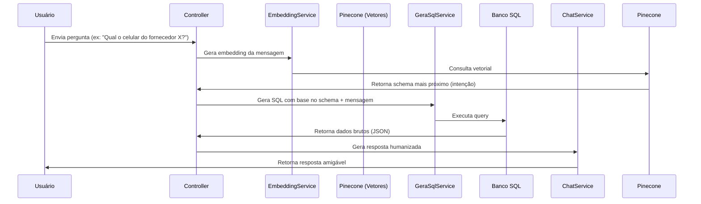

# 🧠 API Inteligente para Geração de SQL com OpenAI + Pinecone + Spring Boot

Esta API converte mensagens em linguagem natural de usuários leigos em **consultas SQL** válidas, utilizando tecnologias modernas como **OpenAI GPT-4**, **Pinecone (vetorização)** e **Spring Boot**. Além disso, ela interpreta os resultados e entrega respostas humanizadas.

---

## 🚀 Fluxo Geral


<br><br>
# 🛠️ Tecnologias Utilizadas
| Tecnologia                | Descrição                              |
| ------------------------- | -------------------------------------- |
| 🧠 OpenAI GPT-4 (Mini)    | Geração de SQL e respostas humanizadas |
| 🔡 text-embedding-3-small | Vetorização semântica das mensagens    |
| 🧩 Pinecone               | Armazenamento e busca vetorial         |
| ☕ Spring Boot             | Backend robusto em Java                |
| 🗄️ PostgreSQL / MySQL    | Banco de dados relacional              |
| 🔌 JdbcTemplate           | Execução de SQL nativo                 |
| 🧰 Jackson                | Conversão de objetos Java ↔️ JSON      |

<br><br>
# 📦 Componentes do Sistema

## 🔹 EmbeddingService
### 🔍 Função
Converte qualquer texto em vetores numéricos, utilizados para identificar intenções ou schemas similares no banco vetorial.

---

## 🔹 IntencaoService
### 🔍 Função
Salva schemas ou exemplos de intenção no Pinecone como vetores.  
Permite que a API "lembre" como responder perguntas parecidas no futuro.

---

## 🔹 MensagemService
### 🔍 Função
Consulta o Pinecone usando embeddings da pergunta do usuário e recupera o texto de intenção mais semelhante.

---

## 🔹 GeraSqlService
### 🔍 Função
Gera SQLs confiáveis com base no schema + pergunta do usuário, usando GPT-4.

✅ **Nunca inventa tabelas ou colunas**  
⚠️ **Prompt com instruções rígidas para precisão máxima**

---

## 🔹 RespostaService
### 🔍 Função
Executa o SQL gerado no banco relacional e retorna os dados como JSON.

🧪 **Resultado auditável** e tratado com `try/catch`

---

## 🔹 ChatService
### 🔍 Função
Converte o JSON retornado em uma resposta natural e objetiva.

🎯 **Direto ao ponto**  
📅 **Datas no padrão YYYY-MM-DD**  
😄 **Tom amigável, porém técnico**

<br><br>
# 📥 Exemplo de Requisição
```http
POST /api/mensagem
Content-Type: application/json

{
  "mensagem": "Qual o celular do fornecedor Fornecedor A?"
}
```
# 📤 Exemplo de Resposta
```json
{
  "resposta": "O celular do fornecedor Fornecedor A é 11 98765-4321."
}
```
<br><br>
# 🧠 Inteligência da API
🚫 Não inventa colunas ou tabelas: sempre segue apenas o schema.

📊 Foco em intenção: entende o que o usuário quer, não o que ele escreveu.

🗃️ Schema vetorizado: permite evolução dinâmica do banco, sem hardcode.

💬 Resposta natural: evita linguagem técnica e responde como um atendente real.

📅 Datas são normalizadas: sempre no padrão YYYY-MM-DD.
<br><br>

# 🔒 Segurança e Robustez
SQL com temperature 0.0: máxima precisão.

Controle de erros no RespostaService.

Prompting controlado para evitar alucinações da IA.

Queries sempre auditáveis via System.out.println.
<br><br>

# 📦 Futuras Melhorias
 Adicionar cache para embeddings repetidos.

 Suporte a múltiplas bases SQL.

 Interface gráfica (ex: Swagger ou front-end em React).

 Tradução automática da resposta com base no idioma do usuário.

 Autenticação e autorização.
 <br><br>

# 🤖 Autor
 <div align=center>
  <table style="width: 100%">
    <tbody>
      <tr align=center>
        <th><strong> João Victor de Lima </br> JoaovlLima </strong></th>
      </tr>
      <tr align=center>
        <td>
          <a href="https://github.com/JoaovlLima">
            
          </a>
        </td>
      </tr>
    </tbody>

  </table>
</div>

